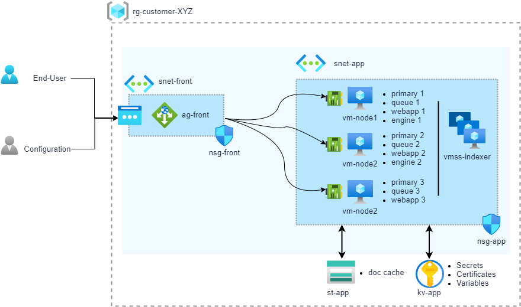

# ARM

Sinequa For Azure (S4A) ARM is a set of ARM templates used for a Sinequa ES grid deployment

#### Table of contents
1. [Deploy a Sinequa Grid](#deploy)<br>
2. [Node specialization](#specify)<br>
3. [Add node to a Sinequa Grid](#add)<br>
   3.1. [Add a VM Node](#add_vm)<br>
   3.2. [Add a VMSS Node](#add_vmss)<br>
4. [Update a Sinequa Grid](#update)<br> 
   4.1. [Update a VM Node](#update_vm)<br>
   4.2. [Update a VM Node](#update_vmss)<br>
   
This main ARM template deploys a complete Sinequa Grid.

Note: These ARM templates are those used for the Azure Marketplace. They are designed for being called from an URI (due to the nested templates)


## Diagram



## Scripts

### 1. Deploy a Sinequa Grid <a name="deploy">

For deploying a Grid from the Marketplace or from your own image, ARM (Azure Resource Manager) deployment is used.

```powershell
sinequa-for-azure-deploy-grid.ps1
    [[-subscriptionId] <String>]    
    [-templateFile <String>]    
    [-templateParameterFile <SecureString>]    
    [[-resourceGroupName] <String>]    
    [[-galleryName] <String>]    
    [[-imageDefinitionName] <String>]    
    [[-imageName] <String>]    
    [[-version] <String>]
```

Example:
```powershell
PS C:\> .\sinequa-for-azure-deploy-grid.ps1 -subscriptionId 00000000-0000-0000-0000-000000000000 -resourceGroupName sq-grid
```
This script will deploy the `mainTemplate.json` file:
* mainTemplate.json, ARM template which can instantiate a complete grid with:
  * 1 Application Gateway
  * 1 Availability Set
  * 1 Keyvault
  * 2 Network security group
  * 1 Public IP address
  * 1 Storage account
  * 1 Virtual machine scale sets
  * 1 Virtual network
  * 1 or 3 Virtual Machines for Primary Nodes
* mainTemplate.parameters.json: paramaters that should be updated

| Parameter              | Default Value                  | Description       |
| ---------------------- | ------------------------------ | ----------------- |
| prefix                 | sq                             | Prefix of object names |
| location               | Location of the resource group |
| adminUsername 	     | sinequa                        | Windows User |
| adminPassword 	     |                                | Windows User Password |
| vmSize 		         |                                | vmSize of primary nodes |
| vmIndexerSize 	     |                                | vmSize of the indexer Scale Set. Default |
| vmIndexerScaleSetSize  | 1                              | Indexer Scale Set size (instances) |
| primaryNodeCount 	     | 3                              | Number of primary nodes (1 or 3) |
| certificateBase64 	 |                                | Certificate file (pfx) in base64 format for HTTPS |
| certificatePassword    |                                | Password of the certificate |
| license                |                                | Sinequa Licence |
| imageReferenceId       | none                           | Id of the custom image to use. If empty the marketplace will be used.<br> Example: "/subscriptions/00000000-0000-0000-0000-000000000000/resourceGroups/Sinequa/providers/Microsoft.Compute/galleries/SinequaForAzure/images/sinequa-11-nightly" |
| virtualNetworkName 	 |                                | Virtual Network object |
| _artifactsLocation     | deployment().properties.templateLink.uri | (don't change) used for nested templates |
| _artifactsLocationSasToken |                            | (don't change) used for nested templates |

Note: Some variables could be change like:
* node1_name
* node2_name
* node2_name

### 2. Node specialization <a name="specify">

* **Cloud Tags of `vm-node1`**
    | Name                     | Value |
    | ------------------------ | ----- |
    | sinequa-auto-disk	       | auto |
	| sinequa-path		       | f:\sinequa |
	| sinequa-data-storage-url | https://`{storage account name}`.blob.core.windows.net/sinequa |
	| sinequa-primary-node-id  | 1 |
	| sinequa-node	           | vm-node1 |
	| sinequa-webapp 		   | webapp1 | 
	| sinequa-engine		   | engine1 |

* **Cloud Tags of `vm-node2`**
    | Name                     | Value |
    | ------------------------ | ----- |
    | sinequa-auto-disk	       | auto |
	| sinequa-path		       | f:\sinequa |
	| sinequa-data-storage-url | https://`{storage account name}`.blob.core.windows.net/sinequa |
	| sinequa-primary-node-id  | 2 |
	| sinequa-node	           | vm-node2 |
	| sinequa-webapp 		   | webapp2 |
	| sinequa-engine		   | engine2 |

* **Cloud Tags of `vm-node3`**
    | Name                     | Value |
    | ------------------------ | ----- |
    | sinequa-auto-disk	       | auto |
	| sinequa-path		       | f:\sinequa |
	| sinequa-data-storage-url | https://`{storage account name}`.blob.core.windows.net/sinequa |
	| sinequa-primary-node-id  | 3 |
	| sinequa-node	           | vm-node3 |
	| sinequa-webapp 		   | webapp3 |

* **Cloud Vars (in Storage Account)**
    | Name                     | Value |
    | ------------------------ | ----- |
	| sinequa-primary-nodes    | 1=srpc://vm-node1:10300;2=srpc://vm-node2:10300;3=srpc://vm-node3=10300 |
    | sinequa-beta             | true |
	| sinequa-keyvault 	       | `{Key Vault Name}` |
	| sinequa-queue-cluster    | QueueCluster1(vm-node1,vm-node2,vm-node3) |
	
* **Cloud secrets (Secrets in Key Vault)**
    | Name                     | Value |
    | ------------------------ | ----- |
	| sinequa-license		   | `{License}` |


### 3. Add node to a Sinequa Grid <a name="add">	
#### 3.1. Add a VM Node <a name="add_vm"> 
In `mainTemplate.json` add a new resource using the nested template `vm.json` (templateLink.uri= "[variables('vm_template_uri')]") and re-deploy.

#### 3.2. Add a VMSS Node <a name="add_vmss"> 
In `mainTemplate.json` add a new resource using the nested template `vmss.json` (templateLink.uri= "[variables('vmss_template_uri')]") and re-deploy.

### 4. Update a Sinequa Grid <a name="update"> 
#### 4.1. Update a VM Node <a name="update_vm">   
This is not possible via ARM. You have to update manually your VM by doing a classical Sinequa update inside the VM.

#### 4.2. Update a VMSS Node <a name="update_vmss">    
This is not possible via ARM. You have to update manually your VMSS by deleting the VMSS and rexecute a deployment.

