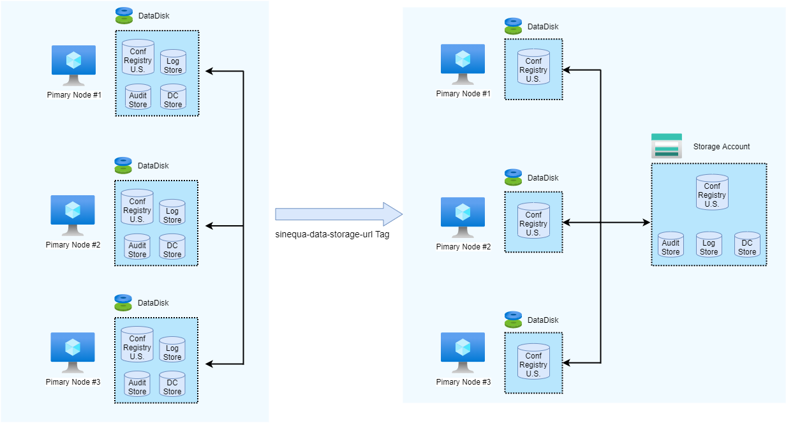

# Sinequa For Azure (S4A)

Sinequa For Azure (S4A) is a set of capabilities and dedicated features designed for Azure.

In case you don't want to install Sinequa For Azure using the PowerShell and Terraform scripts, you can read this guide: [S4A - Deploy using agnostic Infrastructure as Code](./installation)

#### Table of Contents
0. [Prerequisistes](#prerequisites) 
1. [Repository Content](#content) 
2. [Sinequa Azure Features](#features) 
2.1. [Cloud Init](#cloudinit) 
2.2. [Leverage Storage Account](#storageaccount) 
2.3. [Leverage a Secondary Storage Account](#secondarystorageaccount) 
2.4. [Leverage Scale Set for Elasticity](#scaleset) 
2.5. [Back Up and Restore the Application](#backup) 
  
## 0. Prerequisites <a name="prerequisites">
* Access to https://portal.azure.com
* Install Azure CLI: https://docs.microsoft.com/en-us/cli/azure/install-azure-cli-windows?tabs=azure-cli
* Install Azure Powershell: https://docs.microsoft.com/fr-fr/powershell/azure/install-az-ps
* Install Terraform: https://www.terraform.io/downloads.html
  
## 1. Repository Content <a name="content">

This repository contains:
* **[Powershell](./S4A_Image)** scripts to **[build your own Sinequa image](./S4A_Image)** 
* **[Terraform](./terraform)** samples to **[deploy a Sinequa grid](./terraform)** 

## 2. Sinequa Azure Features <a name="features">

### 2.1. Cloud Init <a name="cloudinit"> 

The cloud init features are some capabilities used upon VM deployment to initialize an out-of-the-box Sinequa node that is automaticaly registered into a grid with some roles enabled (like engine, indexer, etc.).

#### 2.1.1. Environment Variable <a name="envvars"> 

You must set the **SINEQUA_CLOUD** environment variable before starting the Sinequa service to enable all Sinequa For Azure features such as the **cloud init**.

| Name                     | Value                                | Description                          |
| ------------------------ | ------------------------------------ | ------------------------------------ |
|	SINEQUA_CLOUD          | "Azure"                              | Enable cloud init features.          |

#### 2.1.2. Cloud Tags <a name="cloudtags"> 

Cloud tags are Azure tags used on Azure resources. They are used to run some specific init tasks for a particular VM or VMSS. 

Note: Cloud tags are available as "Environment Variables" in the product with the `_CloudTag_` prefix. E.g The `sinequa-node` tag value is accessible through the `_CloudTag_sinequa-node` Environment Variable.

| Name                         | Value Example                        | Description                          |
| ---------------------------- | ------------------------------------ | ------------------------------------ |
|	sinequa-data-storage-url   | https://`{storage account name}`.blob.core.windows.net/`{container}`/grids/`{grid-name}` | Used to enable storage of: * Configuration * User settings * Document cache * Log store * Audit store and to declare cloud variables  (see bellow).|
|   sinequa-auto-disk          | "auto" or JSON value                | When adding data disks to an Azure VM, they are not partitioned/formatted. If you select "auto", all raw disks are automaticaly enabled. |
|	sinequa-path		       | "f:\sinequa".  Default is `distrib_path` | `sinequa-path` is the root folder for all customer data, as opposed to `distrib-path` that only contains binaries on the OS disk. `sinequa-path` should be located on a dedicated Azure data disk. |
|	sinequa-index-path	       | "g:\sinequa". Optional. Default is sinequa-path | `sinequa-index-path` is the root folder for all indexes. It is recommended to use it for NVMe disks. | 
|	sinequa-node               | "node1"                             | Node name. |
|   sinequa-primary-node-id    | 1 (or 2 or 3 or empty)              | To be used on [primary nodes](https://doc.sinequa.com/en.sinequa-es.v11/Content/en.sinequa-es.admin-grid-primary-nodes.html). |
|	sinequa-kestrel-webapp     | "webapp1"                           | Name of the [ Kestrel WebApp](https://doc.sinequa.com/en.sinequa-es.v11/Content/en.sinequa-es.admin-grid-webapps.html) to be created and started on this node.  |
|	sinequa-webapp-fw-port     | 80                                  | TCP Port to allow in Windows firewall. |
|	sinequa-engine		       | "engine1"                           | Name of the [engine](https://doc.sinequa.com/en.sinequa-es.v11/Content/en.sinequa-es.admin-grid-engines.html) to be created and started on this node.  |
|	sinequa-indexer		       | "indexer1"                          | Name of the [indexer](https://doc.sinequa.com/en.sinequa-es.v11/Content/en.sinequa-es.admin-grid-indexers.html) to be created and started on this node. |

#### 2.1.3. Cloud Variables & Cloud Secrets <a name="cloudvars"> 

* Cloud variables are Azure blobs stored in the storage account. They are used to declare global variables in the configuration.

Note: Cloud variables are available as "Environment Variables" in the product with the `_CloudVar_` prefix. E.g The `sinequa-beta` cloud var value is accessible through the `_CloudVar_sinequa-beta` Environment Variable.

* Cloud secrets are secrets stored in the key vault defined in cloud variables. They are used to store sensitive data.

Note: Cloud secrets begining with the `sinequa-env-`prefix are available as "Environment Variables" in the product with the `_CloudSecret_` prefix. E.g The `sinequa-env-my-secret` secret value is accessible through the `_CloudSecret_sinequa-env-my-secret` Environment Variable.

| Name                                      | Cloud Var | Cloud Secret | Value Example                        | Description                          |
| ----------------------------------------- | --------- | ------------ | ------------------------------------ | ------------------------------------ |
|	sinequa-primary-nodes                   | x         |              | "1=srpc://vm-node1:10300;2=srpc://vm-node2:10300;3=srpc://vm-node3=10300" | sRPC connection string of primary nodes. |
|   sinequa-keyvault 	                    | x         |              | "kv-grid1"                           | Name of the key vault containing secrets (see below). |
|   sinequa-queue-cluster 	                | x         |              | "QueueCluster1(node1,node2,node3)"   | Creates and starts a [queue cluster](https://doc.sinequa.com/en.sinequa-es.v11/Content/en.sinequa-es.admin-grid-queue-clusters.html). |
|	sinequa-beta		                    | x         |              | true or false                        | Enables beta features. |
|   sinequa-encryption-key                  | x         | x            | xxxxx                                | Encryption key (see the documentation on [how to generate your own encryption key](https://doc.sinequa.com/en.sinequa-es.v11/Content/en.sinequa-es.how-to.encrypt.html#generating-encryption-key)) |
|   sinequa_authentication_secret           | x         | x            | xxxxx                                | Secret for authenticating all sRPC calls |
|	sinequa-license		                    | x         | x            | xxxxx                                | Sinequa license. |
|	sinequa-default-admin-password          | x         | x            | xxxxx                                | Default Sinequa admin password. |
|	sinequa-ssl-force                       | x         | x            | true or false                        | Forces SSL on sRPC. |
|	sinequa-ssl-roots-pem-file              | x         | x            |                                      | pem file for sRPC. |
|	sinequa-ssl-server-ca-crt               | x         | x            |                                      | ca crt file for sRPC. |
|	sinequa-ssl-server-crt                  | x         | x            |                                      | Server crt file for sRPC. |
|	sinequa-ssl-server-key                  | x         | x            |                                      | Server private key for sRPC. |
|	sinequa-ssl-client-certificate-check    | x         | x            |                                      | Client certificate check for sRPC. |
|	sinequa-ssl-client-ca-crt               | x         | x            |                                      | Client ca crt file for sRPC. |
|	sinequa-ssl-client-crt                  | x         | x            |                                      | Client crt file for sRPC. |
|	sinequa-ssl-client-key                  | x         | x            |                                      | Client private key for sRPC. |
|	sinequa-ssl-client-override-host-name   | x         | x            |                                      | Overrides host name for sRPC. |

#### 2.1.4. Cloud Aliases <a name="cloudaliases"> 

* Cloud Aliases are Azure blobs stored in the primary storage account. They are used to declare Sinequa aliases in the configuration.

| Key                                       | Value Example                        | Description                          |
| ----------------------------------------- | ------------------------------------ | ------------------------------------ |
|	grids/`{grid name}`/aliases/node/`{alias name}`"                   | "vm-node-1"            | Create an `{alias name}` node alias. |
|	grids/`{grid name}`/aliases/nodelist/`{alias name}`"               | "vm-node-1,vm-node-2"  | Create an `{alias name}` node alias list. |
|	grids/`{grid name}`/aliases/engine/`{alias name}`"                 | "engine1"              | Create an `{alias name}` engine alias. |
|	grids/`{grid name}`/aliases/enginelist/`{alias name}`"             | "engine1,engine2"      | Create an `{alias name}` engine alias list. |
|	grids/`{grid name}`/aliases/index/`{alias name}`"                  | "index1"               | Create an `{alias name}` index alias. |
|	grids/`{grid name}`/aliases/indexlist/`{alias name}`"              | "index1,index2"        | Create an `{alias name}` index alias list. |
|	grids/`{grid name}`/aliases/indexer/`{alias name}`"                | "indexer1"             | Create an `{alias name}` indexer alias. |
|	grids/`{grid name}`/aliases/indexerlist/`{alias name}`"            | "indexer1,indexer2"    | Create an `{alias name}` indexer alias list. |
|	grids/`{grid name}`/aliases/identity/`{alias name}`"               | "node/identity0"                   | Create an `{alias name}` identity alias. |
|	grids/`{grid name}`/aliases/identitylist/`{alias name}`"           | "node/identity0,node/identity1"    | Create an `{alias name}` identity alias list. |

### 2.2. Leverage Storage Account <a name="storageaccount"> 

To reduce the cost of the disk usage and have a better reliability and availabilty on data, an Azure Blob storage account is broadly used for all data that do not require high I/O performances.

If a `sinequa-data-storage-url` cloud tag is provided, the components below will automatically synchronize data from disk to Azure Storage account.

It concerns:
* Document cache store
* User settings
* Registry
* Configuration
* Audit store
* Log store

### 2.3. Leverage a Secondary Storage Account <a name="secondarystorageaccount"> 

As Blobs have not the same size and not the same frequency of access, a second storage could be used for leveraging cheaper SKUs.

If a `sinequa-data-storage-url` cloud tag is provided (primary storage), and if this storage contains an org var called `st-org-root-secondary` then some blobs will be moved to this secondary Azure Storage account.

#### Asure Storage SKU recommendations:
- Primary Storage with the `Premium` sku for fast access and small content (blob < 10ko)
- Secondary Storage with the `Standard Hot` sku for large content (sha + queue + logs)

#### Storage hierarchy:
* Primary Storage (Premium --> blob <= 10K)
  * /`{org name}`
    * /var
	  * /st-org-root-secondary => contains url of the secondary storage
    * /grids
	  * /`{grid name}`
	    * /var
        * /Document cache store
        * /User settings
        * /Registry
        * /Configuration

* Secondary Storage (Standard Hot)
  * /`{org name}`
	* /grids
	  * /`{grid name}`
        * /audit
		* /log
		* /queue-volumes
	* /sha
	  * /blobs

### 2.4. Leverage Scale Set for Elasticity <a name="scaleset"> 

To reduce the cost of VM usage and control the indexing workload, scale set is used to scale up & down the number of indexers based on the indexing workload.

### 2.5. Back Up and Restore the Application <a name="backup"> 

Thanks to [Storage Accounts](#storageaccount), you can easily back up and restore a complete grid with consistency between components. 

* You can back up the engine directly into an Azure Storage acccount.

*  and restore 

