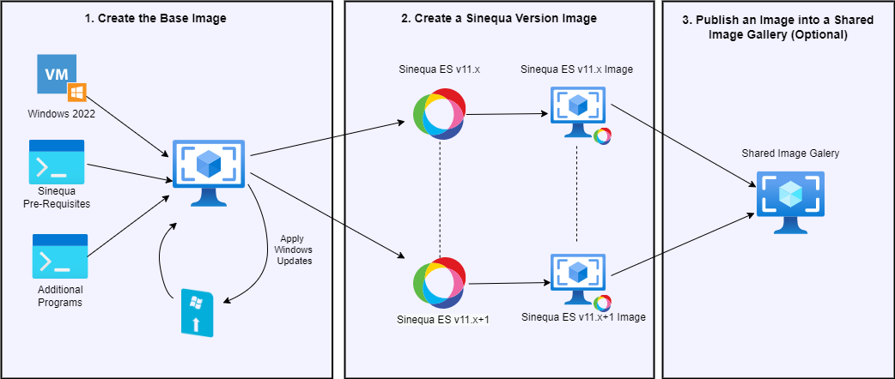

# S4A_Image 

Sinequa For Azure (S4A) Image is a set of scripts for creating your own Sinequa image on Azure. 

#### Table of Contents
1. [Create the Base Image](#ownimage_base)<br>
2. [Create a Sinequa Version Image](#ownimage_version)<br>
3. [Publish an Image in a Shared Image Gallery (Optional)](#ownimage_shared)<br>

In the script folder, different PowerShell scripts allow you to create your own Sinequa Azure image that you can deploy to create a Sinequa grid.

Depending on where Sinequa images are located and where you deploy a grid, you can use different sources:
- Deploy a grid in the **same tenant** but not in the same subscription: Use your own **Shared Image Gallery**.
- Deploy a grid in the **same subscription**: Use your own **Shared image gallery** or your own **image**.

## Diagram



## Scripts

#### 1. Create the Base Image <a name="ownimage_base">
This first image is a **Windows Base Image** (Microsoft Windows 2022 Datacenter) including **all Sinequa prerequisites** and **additional programs** that you want to install before building a specific version of Sinequa.

```powershell
sinequa-for-azure-build-base-image.ps1
    [[-tenantId] <String>]    
    [[-subscriptionId] <String>]    
    [-user <String>]    
    [-password <SecureString>]    
    [[-location] <String>]    
    [[-imageResourceGroupName] <String>]    
    [[-imageName] <String>]    
    [[-tempResourceGroupName] <String>]    
    [[-osUsername] <String>]    
    [[-osPassword] <Securetring>]       
    [[-imageSku] <String>]   
```
| Parameter              | Default Value                   | Description |
| ---------------------- | ------------------------------- | ----------- |
| tenantId               | $env:AZURE_PRODUCT_TENANT       | Tenant ID used for login. |
| subscriptionId         | $env:AZURE_PRODUCT_SUBSCRIPTION | Subscription ID used for login. |
| user 	                 | $env:AZURE_BUILD_USER           | User for login. |
| password 	             | $env:AZURE_BUILD_PWD            | Password for login. |
| location               | francecentral                   | Azure region. |
| imageResourceGroupName | rg-sinequa                      | Resource group name of the base image to create. |
| imageName              | sinequa-base-image              | Name of the image containing the prerequisites and additional programs. |
| tempResourceGroupName  | temp-sinequa-base-image         | Transient resource group for building a VM to generalize. |
| osUsername             | sinequa                         | OS user for the transient VM. |
| osPassword             | Password1234                    | OS password for the transient VM. |
| imageSku               | 2022-datacenter-smalldisk       | Windows Image. |

Example:
```powershell
PS C:\> .\sinequa-for-azure-build-base-image.ps1 -tenantId 00000000-0000-0000-0000-000000000000 -subscriptionId 00000000-0000-0000-0000-000000000000
```

This script runs the following custom script extensions:
* `sinequa-az-cse-install-programs.ps1` to install Sinequa prerequisites and optional programs. This script can be customized.
    * Install a Custom BGInfo that displays the Sinequa ES version.
    * Install C++ Resdistribuable.
    * Install 7zip.
    * Install Google Chrome.
    * Install NotePad++.
    * Install Visual Code.
    * Install GIT client.
* `sinequa-az-cse-windows-update.ps1` to apply Windows updates.

#### 2. Create a Sinequa Version Image <a name="ownimage_version">
Create a **Sinequa image** from a **distribution file** (sinequa.11.zip). This script installs Sinequa (unzip & install services) that can be specialized (engine, indexer, .. roles) upon first init (i.e. deployment).
* You must set `localFile` or `fileUrl`.

```powershell
sinequa-for-azure-build-image.ps1
    [[-tenantId] <String>]    
    [[-subscriptionId] <String>]    
    [-user <String>]    
    [-password <SecureString>]    
    [[-location] <String>]    
    [[-imageResourceGroupName] <String>]    
    [[-baseImageName] <String>]    
    [-imageName <String>]    
    [-version <String>]
    [[-tempResourceGroupName] <String>]    
    [[-localFile] <String>]
    [[-fileUrl] <String>]
    [[-osUsername] <String>]    
    [[-osPassword] <Securetring>]       
```

| Parameter              | Default Value                   | Description |
| ---------------------- | ------------------------------- | ----------- |
| tenantId               | $env:AZURE_PRODUCT_TENANT       | Tenant ID used for login. |
| subscriptionId         | $env:AZURE_PRODUCT_SUBSCRIPTION | Subscription ID used for login. |
| user 	                 | $env:AZURE_BUILD_USER           | User for login. |
| password 	             | $env:AZURE_BUILD_PWD            | Password for login. |
| location               | francecentral                   | Azure region. |
| imageResourceGroupName | rg-sinequa                      | Resource group name of both the base image and the new image to create. |
| baseImageName          | sinequa-base-image              | Name of the image containing the prerequisites and additional programs. |
| imageName 	         |                                 | Name of the image to create (e.g: sinequa-nightly-11.7.0.0). |
| version 	             |                                 | Sinequa Version (e.g.: 11.7.0.0). |
| localFile 	         |                                 | Local distribution file to use (e.g.: c:\install\sinequa.11.zip). |
| fileUrl 	             |                                 | URL of the distribution file to use (e.g.: https://constoso.com/sinequa.11.zip). |
| tempResourceGroupName  | temp-sinequa-image              | Transient resource group for building a VM to generalize. |
| osUsername             | sinequa                         | OS user for the transient VM. |
| osPassword             | Password1234                    | OS password for the transient VM. |

Example:
```powershell
PS C:\> .\sinequa-for-azure-build-image.ps1 -version 11.5.1.54 -tempResourceGroupName temp-sinequa-image-11.5.1.54 -imageName sinequa-nightly-11.5.1.54 -localfile c:\builds\11.5.1.54\sinequa.11.zip -tenantId 00000000-0000-0000-0000-000000000000 -subscriptionId 00000000-0000-0000-0000-000000000000
```


#### 3. Publish an Image into a Shared Image Gallery (Optional) <a name="ownimage_shared">
This script publishes an **image** into an existing **Shared Image Gallery**. An existing Shared Image Gallery with at least one image definition is required.

```powershell
sinequa-for-azure-image-to-gallery.ps1
    [[-tenantId] <String>]    
    [[-subscriptionId] <String>]    
    [-user <String>]    
    [-password <SecureString>]    
    [[-location] <String>]    
    [[-imageResourceGroupName] <String>]    
    [[-galleryName] <String>]    
    [[-imageDefinitionName] <String>]    
    [-imageName <String>]    
    [-version <String>]
    [[-deleteOlds] <Boolean>]
```

| Parameter              | Default Value                   | Description |
| ---------------------- | ------------------------------- | ----------- |
| tenantId               | $env:AZURE_PRODUCT_TENANT       | Tenant ID used for login. |
| subscriptionId         | $env:AZURE_PRODUCT_SUBSCRIPTION | Subscription ID used for login. |
| user 	                 | $env:AZURE_BUILD_USER           | User for login. |
| password 	             | $env:AZURE_BUILD_PWD            | Password for login. |
| location               | francecentral                   | Azure region. |
| imageResourceGroupName | rg-sinequa                      | Resource group name of both the image to share & the Shared Image Gallery.|
| galleryName            | SinequaForAzure                 | Shared Image Gallery name. |
| imageDefinitionName 	 | sinequa-11-nightly              | Image definition name. |
| imageName              |                                 | Image name to share (e.g.: sinequa-release-11.7.0.0). |
| version 	             |                                 | Sinequa version (e.g.: 11.7.0.0). |
| deleteOlds             | false                           | Keeps the last 5 images only. |

Example:
```powershell
PS C:\> .\sinequa-for-azure-image-to-gallery.ps1 -version 11.5.1.54 -imageName sinequa-nightly-11.5.1.54 -tenantId 00000000-0000-0000-0000-000000000000 -subscriptionId 00000000-0000-0000-0000-000000000000
```

