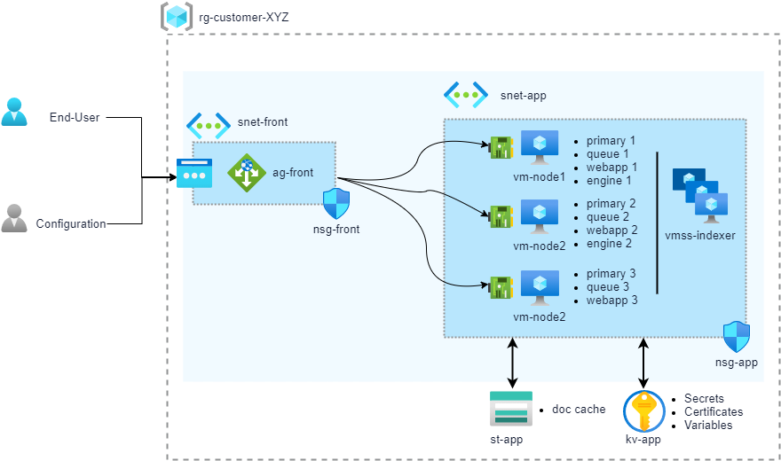

# Terraform

Sinequa For Azure (S4A) Terraform is a set of Terraform scritps used for a Sinequa ES grid deployment

#### Table of contents
0. [Pre-requisite](#prerequisite)<br>
1. [Terraform Modules](#modules)<br>
2. [complete_grid Sample](#complete_grid)<br>
2.1. [Nodes specialization](#specify)<br>
2.2. [Add nodes to a Sinequa Grid](#add)<br>
2.2.1.  [Add a VM Node](#add_vm)<br>
2.2.2.  [Add a VMSS Node](#add_vmss)<br>
2.2.3.  [Update a Sinequa Grid](#update)<br>

   

## Diagram



## Scripts

### 0. Pre-requisite <a name="prerequisite">

* https://www.terraform.io/downloads.html

### 1. Terraform Modules <a name="modules">

In the modules folder, scritps are provided for building blocks:

* **frontend**: Deploys an `Application Gateway` with a `Public IP`

| Variables                | Description |
| ------------------------ | ----------- |
| location                 | Azure location |
| resource_group_name      | Resource Group for deployment |
| availability_set_name    | Availability Set name to create. Needed for the Application Gateway |
| application_gateway_name | Name of the Application Gateway to create |
| subnet_id                | Subnet Id for the Application Gateway. Used only for HTTPS from end-users |
| certificate              | Certificate object for SSL. Could be directly the content of a pfx file or a Certificate from a key vault |
| dns_name                 | DNS name prefix for the Application Gateway Public IP |
| kv_identity_reader       | Identity for reading the Key Vault Certificate (if used) |
| tags                     | Azure Tags |

* **network**: Deploys `Network Security Groups` and `Virtual Network`

| Variables                | Description |
| ------------------------ | ----------- |
| location                 | Azure location |
| resource_group_name      | Resource Group for deployment |
| vnet_name                | Virtual Network to create |
| subnet_app_name          | Subnet for VM & VMSS |
| subnet_front_name        | Subnet for the Application Gateway |
| nsg_app_name             | Network Security Group for VM & VMSS  (RDP rule) |
| nsg_front_name           | Network Security Group for the Application Gateway (HTTPS rule) |
| tags                     | Azure Tags |

* **service**: Deploys a `Key Vault` and a `Storage Account`

| Variables                | Description |
| ------------------------ | ----------- |
| location                 | Azure location |
| resource_group_name      | Resource Group for deployment |
| kv_name                  | Key Vault to create |
| st_name                  | Storage Account to create |
| container_name           | Container in the Storage Account |
| license                  | Sinequa License to be uploaded in the key vault as secret |
| blob_sinequa_primary_nodes | Sinequa Cloud Vars for sRPC connection string of primary nodes |
| blob_sinequa_beta        | Sinequa Cloud Vars for enabling beta features |
| blob_sinequa_keyvault    | Sinequa Cloud Vars for specifying the Key Vault Url |
| blob_sinequa_queuecluster | Sinequa Cloud Vars for creating a QueueCluster |
| tags                     | Azure Tags |

* **service**: Deploys a `Key Vault` and a `Storage Account`

| Variables                | Description |
| ------------------------ | ----------- |
| location                 | Azure location |
| resource_group_name      | Resource Group for deployment |
| kv_name                  | Key Vault to create |
| st_name                  | Storage Account to create |
| container_name           | Container in the Storage Account |
| license                  | Sinequa License to be uploaded in the key vault as secret |
| blob_sinequa_primary_nodes | Sinequa Cloud Vars for sRPC connection string of primary nodes |
| blob_sinequa_beta        | Sinequa Cloud Vars for enabling beta features |
| blob_sinequa_keyvault    | Sinequa Cloud Vars for specifying the Key Vault Url |
| blob_sinequa_queuecluster | Sinequa Cloud Vars for creating a QueueCluster |
| tags                     | Azure Tags |

* **vm**: Deploys a `Virtual Machine`

| Variables                | Description |
| ------------------------ | ----------- |
| location                 | Azure location |
| resource_group_name      | Resource Group for deployment |
| vm_name                  | Name of the VM |
| vm_size                  | VM Size |
| computer_name            | VM OS Computer Name |
| subnet_id                | Subnet Id of the VM |
| image_id                 | Sinequa Image to use (Image or Image Definition) for creating the VM |
| os_disk_type             | OS Disk Type |
| data_disk_type           | Size of the Data Disk |
| admin_username           | OS user login |
| admin_password           | OS user password |
| key_vault_id             | Key Vault used for Secrets. Needed to grant read Secrets access on the VM identity |
| storage_account_id       | Storage Account used for Sinequa Cloud Var and Container. Needed to grant read/write access on the VM identity |
| availability_set_id      | Availaibility Set for the Application Gateway |
| pip                      | Add a Public IP if needed |
| linked_to_application_gateway | The VM is linked to an  Application Geteway? |
| backend_address_pool_id  | Backend Address Pool ID of the Application Geteway. Required for VM with Webapp |
| network_security_group_id | Network Security Group of the VM |
| datadisk_ids             | Use existing DataDisk |
| tags                     | Azure Tags for Specifying Sinequa Roles |

* **vmss**: Deploys a `Virtual Machine ScaleSet`

| Variables                | Description |
| ------------------------ | ----------- |
| location                 | Azure location |
| resource_group_name      | Resource Group for deployment |
| vmss_name                | Name of the VMSS |
| vmss_size                | VMSS Size |
| vmss_capacity            | Number of instances of the VMSS |
| computer_name_prefix     | VMSS OS Computer Name prefix |
| subnet_id                | Subnet Id of the VM |
| image_id                 | Sinequa Image to use (Image or Image Definition) for creating the VMSS |
| os_disk_type             | OS Disk Type |
| admin_username           | OS user login |
| admin_password           | OS user password |
| key_vault_id             | Key Vault used for Secrets. Needed to grant read Secrets access on the VMSS identity |
| storage_account_id       | Storage Account used for Sinequa Cloud Var and Container. Needed to grant read/write access on the VMSS identity |
| network_security_group_id | Network Security Group of the VM |
| tags                     | Azure Tags for Specifying Sinequa Roles |

### 2. complete_grid sample <a name="complete_grid">

`complete_grid` is a a deployment of all modules with these objects:
 * 1 Application Gateway
 * 1 Availability Set
 * 1 Keyvault
 * 2 Network security groups
 * 1 Public IP address
 * 1 Storage account
 * 1 Virtual machine scale sets for Indexer
 * 1 Virtual network
 * 3 Virtual Machines for Primary Nodes


```powershell
PS C:\> .\terraform init
PS C:\> .\terraform validate
PS C:\> .\terraform apply
```
#####  2.1. Nodes specialization <a name="specify">

* **Cloud Tags of `vm-node1`**
    | Name                     | Value |
    | ------------------------ | ----- |
    | sinequa-auto-disk	       | auto |
	| sinequa-path		       | f:\sinequa |
	| sinequa-data-storage-url | https://`{storage account name}`.blob.core.windows.net/sinequa |
	| sinequa-primary-node-id  | 1 |
	| sinequa-node	           | vm-node1 |
	| sinequa-webapp 		   | webapp1 | 
	| sinequa-engine		   | engine1 |

* **Cloud Tags of `vm-node2`**
    | Name                     | Value |
    | ------------------------ | ----- |
    | sinequa-auto-disk	       | auto |
	| sinequa-path		       | f:\sinequa |
	| sinequa-data-storage-url | https://`{storage account name}`.blob.core.windows.net/sinequa |
	| sinequa-primary-node-id  | 2 |
	| sinequa-node	           | vm-node2 |
	| sinequa-webapp 		   | webapp2 |
	| sinequa-engine		   | engine2 |

* **Cloud Tags of `vm-node3`**
    | Name                     | Value |
    | ------------------------ | ----- |
    | sinequa-auto-disk	       | auto |
	| sinequa-path		       | f:\sinequa |
	| sinequa-data-storage-url | https://`{storage account name}`.blob.core.windows.net/sinequa |
	| sinequa-primary-node-id  | 3 |
	| sinequa-node	           | vm-node3 |
	| sinequa-webapp 		   | webapp3 |

* **Cloud Tags of `vmss-indexer`**
    | Name                     | Value |
    | ------------------------ | ----- |
    | sinequa-auto-disk	       | auto |
	| sinequa-path		       | f:\sinequa |
	| sinequa-data-storage-url | https://`{storage account name}`.blob.core.windows.net/sinequa |
	| sinequa-node	           | vm-indexer |
	| sinequa-webapp 		   | indexer1 |

* **Cloud Vars (in Storage Account)**
    | Name                     | Value |
    | ------------------------ | ----- |
	| sinequa-primary-nodes    | 1=srpc://vm-node1:10300;2=srpc://vm-node2:10300;3=srpc://vm-node3=10300 |
    | sinequa-beta             | true |
	| sinequa-keyvault 	       | `{Key Vault Name}` |
	| sinequa-queue-cluster    | QueueCluster1(vm-node1,vm-node2,vm-node3) |
	
* **Cloud secrets (Secrets in Key Vault)**
    | Name                     | Value |
    | ------------------------ | ----- |
	| sinequa-license		   | `{License}` |

### 2.2. Add nodes to a Sinequa Grid <a name="add">	
#### 2.2.1 Add a VM Node <a name="add_vm"> 
In `conf.tf` add a new resource using the `vm` module and re-deploy.

```terraform
// Create VM Node 4

locals  {
    node4_name          = "node4"
}

module "vm-node4" {
  source                = "../../modules/vm"
  resource_group_name   = azurerm_resource_group.sinequa_rg.name
  location              = azurerm_resource_group.sinequa_rg.location
  vm_name               = "vm-${local.prefix}-${local.node4_name}"
  computer_name         = local.node4_name
  vm_size               = "Standard_E8s_v3"
  subnet_id             = module.network.vnet.subnet.*.id[0]
  image_id              = local.image_id
  admin_username        = local.os_admin_username
  admin_password        = local.os_admin_password
  key_vault_id          = module.kv_st_services.kv.id
  storage_account_id    = module.kv_st_services.st.id
  network_security_group_id = module.network.nsg_app.id
  pip                   = true

  tags = {
    "sinequa-grid"                        = local.prefix
    "sinequa-auto-disk"                   = "auto"
    "sinequa-path"                        = "F:\\sinequa"
    "sinequa-data-storage-url"            = local.data_storage_url
    "sinequa-node"                        = local.node4_name
    "sinequa-engine"                      = "engine4"
  }

  depends_on = [azurerm_resource_group.sinequa_rg, module.network, module.kv_st_services, module.frontend]
}
```

```powershell
PS C:\> .\terraform apply
```


#### 2.2.2 Add a VMSS Node <a name="add_vmss"> 
In `conf.tf` add a new resource using the `vmss` module and re-deploy.

```terraform
// Create Connector Scale Set
module "vmss-connectors" {
  source                = "../../modules/vmss"
  resource_group_name   = azurerm_resource_group.sinequa_rg.name
  location              = azurerm_resource_group.sinequa_rg.location
  vmss_name             = "vmss-${local.prefix}-connectors"
  computer_name_prefix  = "cnt"
  vmss_size             = "Standard_B2s"
  subnet_id             = module.network.vnet.subnet.*.id[0]
  image_id              = local.image_id
  admin_username        = local.os_admin_username
  admin_password        = local.os_admin_password
  key_vault_id          = module.kv_st_services.kv.id
  storage_account_id    = module.kv_st_services.st.id
  network_security_group_id = module.network.nsg_app.id

  tags = {
    "sinequa-grid"                        = local.prefix
    "sinequa-data-storage-url"            = local.data_storage_url
    "sinequa-node"                        = "connector1"
  }

  depends_on = [azurerm_resource_group.sinequa_rg, module.network, module.kv_st_services]
}
```

### 2.2.3. Update a Sinequa Grid <a name="update"> 
For updating a complete grid, just change the `local.image_id` with the new version, and re-deploy

```terraform
image_id                = "/subscriptions/e88f44fe-533b-4811-a972-5f6a692b0730/resourceGroups/Product/providers/Microsoft.Compute/galleries/SinequaForAzure/images/sinequa-11-nightly/versions/6.1.42"
```

```powershell
PS C:\> .\terraform apply
```
