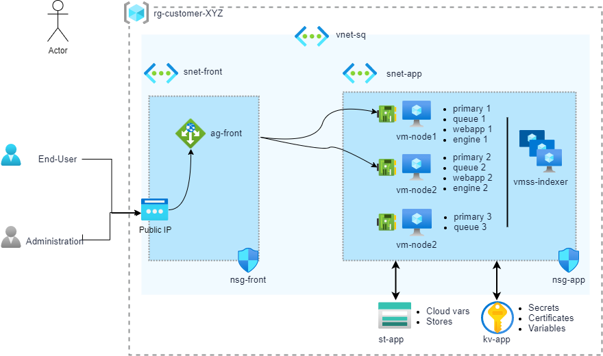

# Terraform

Sinequa For Azure (S4A) Terraform is a set of Terraform scripts used for a Sinequa ES grid deployment.

#### Table of Contents
0. [Prerequisite](#prerequisite)<br>
1. [Terraform Modules](#modules)<br>
2. [complete_grid Sample](#complete_grid)<br>
2.1. [Nodes Specialization](#specify)<br>
2.2. [Add Nodes to a Sinequa Grid](#add)<br>
2.2.1.  [Add a VM Node](#add_vm)<br>
2.2.2.  [Add a VMSS Node](#add_vmss)<br>
2.2.3.  [Update a Sinequa Grid](#update)<br>

   

## Diagram



## Scripts

### 0. Prerequisite <a name="prerequisite">

* https://www.terraform.io/downloads.html

### 1. Terraform Modules <a name="modules">

In the modules folder, scripts are provided to build blocks:

* **frontend**: Deploys an application gateway with a public IP.

| Variables                | Description |
| ------------------------ | ----------- |
| location                 | Azure location. |
| resource_group_name      | Resource group for deployment. |
| availability_set_name    | Availability set name to create. Needed for the application gateway. |
| application_gateway_name | Name of the application gateway to create. |
| subnet_id                | Subnet ID for the application gateway. Used only for HTTPS from end-users. |
| certificate              | Certificate object for SSL. Could be directly the content of a .pfx file or a certificate from a key vault. |
| dns_name                 | DNS name prefix for the application gateway public IP. |
| kv_identity_reader       | Identity for reading the key vault certificate (if used). |
| tags                     | Azure tags. |

* **network**: Deploys network security groups and virtual network.

| Variables                | Description |
| ------------------------ | ----------- |
| location                 | Azure location. |
| resource_group_name      | Resource group for deployment. |
| vnet_name                | Virtual network to create. |
| subnet_app_name          | Subnet for VM & VMSS. |
| subnet_front_name        | Subnet for the application gateway. |
| nsg_app_name             | Network security group for VM & VMSS (RDP rule). |
| nsg_front_name           | Network security group for the application gateway (HTTPS rule). |
| tags                     | Azure tags. |

* **service**: Deploys a key vault and a storage account.

| Variables                | Description |
| ------------------------ | ----------- |
| location                 | Azure location. |
| resource_group_name      | Resource group for deployment. |
| kv_name                  | Key vault to create. |
| st_name                  | Storage account to create. |
| container_name           | Container in the storage account. |
| license                  | Sinequa license to be uploaded in the key vault as secret. |
| blob_sinequa_primary_nodes | Sinequa cloud variable for sRPC connection string of [primary nodes](https://doc.sinequa.com/en.sinequa-es.v11/Content/en.sinequa-es.admin-grid-primary-nodes.html). |
| blob_sinequa_beta        | Sinequa cloud variable to enable beta features. |
| blob_sinequa_keyvault    | Sinequa cloud variable to specify the key vault URL. |
| blob_sinequa_queuecluster | Sinequa cloud variable to create a [queue cluster](https://doc.sinequa.com/en.sinequa-es.v11/Content/en.sinequa-es.admin-grid-queue-clusters.html). |
| tags                     | Azure tags |

* **vm**: Deploys a virtual machine.

| Variables                | Description |
| ------------------------ | ----------- |
| location                 | Azure location. |
| resource_group_name      | Resource group for deployment. |
| vm_name                  | Name of the VM. |
| vm_size                  | VM size. |
| computer_name            | VM OS computer name. |
| subnet_id                | Subnet ID of the VM. |
| image_id                 | Sinequa image to use (image or image definition) to create the VM. |
| os_disk_type             | OS disk type. |
| data_disk_type           | Size of the data disk. |
| admin_username           | OS user login. |
| admin_password           | OS user password. |
| key_vault_id             | Key vault used for secrets. Needed to grant read secrets access on the VM identity. |
| storage_account_id       | Storage account used for Sinequa cloud variable and container. Needed to grant read/write access on the VM identity. |
| availability_set_id      | Availability set for the application gateway. |
| pip                      | Add a public IP if needed. |
| linked_to_application_gateway | The VM is linked to an application gateway. |
| backend_address_pool_id  | Backend address pool ID of the application gateway. Required for VM with WebApp. |
| network_security_group_id | Network security group of the VM. |
| datadisk_ids             | Use existing data disk. |
| tags                     | Azure tags to specify Sinequa roles. |

* **vmss**: Deploys a virtual machine scale set.

| Variables                | Description |
| ------------------------ | ----------- |
| location                 | Azure location. |
| resource_group_name      | Resource group for deployment. |
| vmss_name                | Name of the VMSS. |
| vmss_size                | VMSS size. |
| vmss_capacity            | Number of instances of the VMSS. |
| computer_name_prefix     | VMSS OS computer name prefix. |
| subnet_id                | Subnet ID of the VM. |
| image_id                 | Sinequa image to use (image or image definition) to create the VMSS. |
| os_disk_type             | OS disk type. |
| admin_username           | OS user login. |
| admin_password           | OS user password. |
| key_vault_id             | Key vault used for secrets. Needed to grant read secrets access on the VMSS identity. |
| storage_account_id       | Storage account used for Sinequa cloud variable and container. Needed to grant read/write access on the VMSS identity. |
| network_security_group_id | Network security group of the VM. |
| tags                     | Azure tags to specify Sinequa roles. |

### 2. complete_grid Sample <a name="complete_grid">

`complete_grid\conf.tf` is a deployment of all modules with these objects:
 * 1 application gateway
 * 1 availability set
 * 1 key vault
 * 2 network security groups
 * 1 public IP address
 * 1 storage account
 * 1 virtual machine scale sets for indexer
 * 1 virtual network
 * 3 virtual machines for [primary nodes](https://doc.sinequa.com/en.sinequa-es.v11/Content/en.sinequa-es.admin-grid-primary-nodes.html)


```powershell
PS C:\S4A\terraform\confs\complete_grid> .\terraform init
PS C:\S4A\terraform\confs\complete_grid> .\terraform validate
PS C:\S4A\terraform\confs\complete_grid> .\terraform apply
```
#####  2.1. Nodes Specialization <a name="specify">

* **Cloud tags of `vm-node1`**:
    | Name                     | Value |
    | ------------------------ | ----- |
    | sinequa-auto-disk	       | auto |
	| sinequa-path		       | f:\sinequa |
	| sinequa-data-storage-url | https://`{storage account name}`.blob.core.windows.net/sinequa |
	| sinequa-primary-node-id  | 1 |
	| sinequa-node	           | vm-node1 |
	| sinequa-webapp 		   | webapp1 | 
	| sinequa-engine		   | engine1 |

* **Cloud tags of `vm-node2`**:
    | Name                     | Value |
    | ------------------------ | ----- |
    | sinequa-auto-disk	       | auto |
	| sinequa-path		       | f:\sinequa |
	| sinequa-data-storage-url | https://`{storage account name}`.blob.core.windows.net/sinequa |
	| sinequa-primary-node-id  | 2 |
	| sinequa-node	           | vm-node2 |
	| sinequa-webapp 		   | webapp2 |
	| sinequa-engine		   | engine2 |

* **Cloud tags of `vm-node3`**:
    | Name                     | Value |
    | ------------------------ | ----- |
    | sinequa-auto-disk	       | auto |
	| sinequa-path		       | f:\sinequa |
	| sinequa-data-storage-url | https://`{storage account name}`.blob.core.windows.net/sinequa |
	| sinequa-primary-node-id  | 3 |
	| sinequa-node	           | vm-node3 |
	| sinequa-webapp 		   | webapp3 |

* **Cloud tags of `vmss-indexer`**:
    | Name                     | Value |
    | ------------------------ | ----- |
    | sinequa-auto-disk	       | auto |
	| sinequa-path		       | f:\sinequa |
	| sinequa-data-storage-url | https://`{storage account name}`.blob.core.windows.net/sinequa |
	| sinequa-node	           | vm-indexer |
	| sinequa-webapp 		   | indexer1 |

* **Cloud variables (in Storage account)**:
    | Name                     | Value |
    | ------------------------ | ----- |
	| sinequa-primary-nodes    | 1=srpc://vm-node1:10300;2=srpc://vm-node2:10300;3=srpc://vm-node3=10300 |
    | sinequa-beta             | true |
	| sinequa-keyvault 	       | `{Key Vault Name}` |
	| sinequa-queue-cluster    | QueueCluster1(vm-node1,vm-node2,vm-node3) |
	
* **Cloud secrets (secrets in key vault)**:
    | Name                     | Value |
    | ------------------------ | ----- |
	| sinequa-license		   | `{License}` |

### 2.2. Add Nodes to a Sinequa Grid <a name="add">	
#### 2.2.1 Add a VM Node <a name="add_vm"> 
In `conf.tf`, add a new resource using the `vm` module and re-deploy.

```terraform
// Create VM node 4

locals  {
    node4_name          = "node4"
}

module "vm-node4" {
  source                = "../../modules/vm"
  resource_group_name   = azurerm_resource_group.sinequa_rg.name
  location              = azurerm_resource_group.sinequa_rg.location
  vm_name               = "vm-${local.prefix}-${local.node4_name}"
  computer_name         = local.node4_name
  vm_size               = "Standard_E8s_v3"
  subnet_id             = module.network.vnet.subnet.*.id[0]
  image_id              = local.image_id
  admin_username        = local.os_admin_username
  admin_password        = local.os_admin_password
  key_vault_id          = module.kv_st_services.kv.id
  storage_account_id    = module.kv_st_services.st.id
  network_security_group_id = module.network.nsg_app.id
  pip                   = true

  tags = {
    "sinequa-grid"                        = local.prefix
    "sinequa-auto-disk"                   = "auto"
    "sinequa-path"                        = "F:\\sinequa"
    "sinequa-data-storage-url"            = local.data_storage_url
    "sinequa-node"                        = local.node4_name
    "sinequa-engine"                      = "engine4"
  }

  depends_on = [azurerm_resource_group.sinequa_rg, module.network, module.kv_st_services, module.frontend]
}
```

```powershell
PS C:\S4A\terraform\confs\complete_grid> .\terraform apply
```


#### 2.2.2 Add a VMSS Node <a name="add_vmss"> 
In `conf.tf`, add a new resource using the `vmss` module and re-deploy.

```terraform
// Create connector scale set
module "vmss-connectors" {
  source                = "../../modules/vmss"
  resource_group_name   = azurerm_resource_group.sinequa_rg.name
  location              = azurerm_resource_group.sinequa_rg.location
  vmss_name             = "vmss-${local.prefix}-connectors"
  computer_name_prefix  = "cnt"
  vmss_size             = "Standard_B2s"
  subnet_id             = module.network.vnet.subnet.*.id[0]
  image_id              = local.image_id
  admin_username        = local.os_admin_username
  admin_password        = local.os_admin_password
  key_vault_id          = module.kv_st_services.kv.id
  storage_account_id    = module.kv_st_services.st.id
  network_security_group_id = module.network.nsg_app.id

  tags = {
    "sinequa-grid"                        = local.prefix
    "sinequa-data-storage-url"            = local.data_storage_url
    "sinequa-node"                        = "connector1"
  }

  depends_on = [azurerm_resource_group.sinequa_rg, module.network, module.kv_st_services]
}
```
```powershell
PS C:\S4A\terraform\confs\complete_grid> .\terraform apply
```


### 2.2.3. Update a Sinequa Grid <a name="update"> 
To update a complete grid, just change the `local.image_id` of the `conf.tf` with the new version, then re-deploy.

```terraform
image_id                = "/subscriptions/e88f44fe-533b-4811-a972-5f6a692b0730/resourceGroups/Product/providers/Microsoft.Compute/galleries/SinequaForAzure/images/sinequa-11-nightly/versions/6.1.42"
```

```powershell
PS C:\S4A\terraform\confs\complete_grid> .\terraform apply
```
