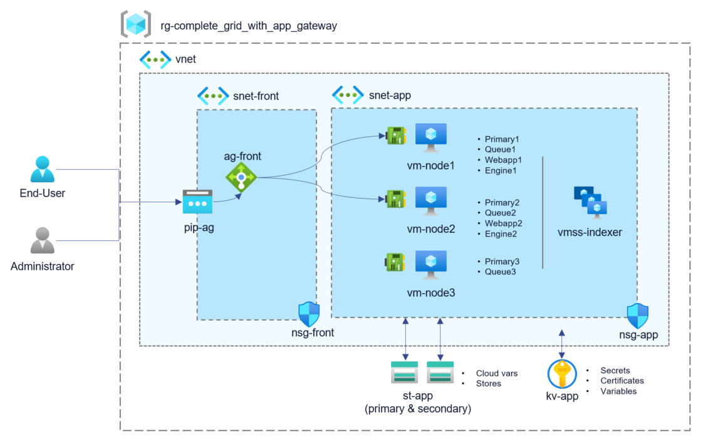

# Terraform 

Sinequa For Azure (S4A) Terraform is a set of Terraform scripts used for a Sinequa ES grid deployment.

#### Table of Contents
0. [Prerequisite](#prerequisite)<br>
1. [Terraform Modules](#modules)<br>
2. [complete_grid Sample](#complete_grid)<br>
3. [complete_2grids Sample](#complete_2grids)<br>
4. [complete_grid_with_app_gateway Sample](#complete_grid_with_app_gateway)<br>
5. [standalone_server Sample](#standalone_server)<br>
6. [Operations](#operations)<br>
6.1.  [Add a VM Node](#add_vm)<br>
6.2.  [Add a VMSS Node](#add_vmss)<br>
6.3.  [Update a Sinequa Grid](#update)<br>

  
## Scripts

### 0. Prerequisite <a name="prerequisite">

* https://www.terraform.io/downloads.html
* Access to https://portal.azure.com
* Install Azure CLI: https://docs.microsoft.com/en-us/cli/azure/install-azure-cli-windows?tabs=azure-cli

### 1. Terraform Modules <a name="modules">

In the modules folder, scripts are provided to build blocks:

* **frontend**: Deploys an application gateway with a public IP.

| Variables                | Description |
| ------------------------ | ----------- |
| location                 | Azure location. |
| resource_group_name      | Resource group for deployment. |
| availability_set_name    | Availability set name to create. Needed for detecting if a vm is available for the application gateway (load balancer). |
| application_gateway_name | Name of the application gateway to create. |
| subnet_id                | Subnet ID for the application gateway. Used only for HTTPS from end-users. |
| certificate              | Certificate object for SSL. Could be directly the content of a .pfx file or a certificate from a key vault. |
| dns_name                 | DNS name prefix for the application gateway public IP. |
| kv_identity_reader       | Identity for reading the key vault certificate (if used). |
| tags                     | Azure tags. |

* **network**: Deploys network security groups and virtual network.

| Variables                | Description |
| ------------------------ | ----------- |
| location                 | Azure location. |
| resource_group_name      | Resource group for deployment. |
| vnet_name                | Virtual network to create. |
| subnet_app_name          | Subnet for VM & VMSS. |
| subnet_front_name        | Subnet for the application gateway. |
| nsg_app_name             | Network security group for VM & VMSS (RDP rule). |
| nsg_front_name           | Network security group for the application gateway (HTTPS rule). |
| require_front_subnet     | boolean for enabling the subnet_front network. Default false. |
| allow_http_on_app_nsg    | boolean for opening HTTP on subnet_app. Use this option if no App GW. Not recommanded as it's not secured. Default false. |
| tags                     | Azure tags. |

* **service**: Deploys a key vault and a storage account.

| Variables                | Description |
| ------------------------ | ----------- |
| location                 | Azure location. |
| resource_group_name      | Resource group for deployment. |
| kv_name                  | Key vault to create. Name as to be unique on Azure. |
| st_premium_name          | Primary Storage account to create. Name as to be unique on Azure. |
| st_hot_name              | Secondary Storage account to create. Name as to be unique on Azure. |
| org_name                 | Organization Name. An Orgranization can contains several grids (like dev, prod) |
| grid_name                | Grid Name to deploy (e.g: dev) |
| license                  | Sinequa license to be uploaded in the key vault as secret. Optional. |
| admin_password           | Store the OS password as secret |
| default_admin_password   | Store the default Sinequa ES admin password as secret |
| blob_sinequa_primary_nodes | Sinequa cloud variable for sRPC connection string of [primary nodes](https://doc.sinequa.com/en.sinequa-es.v11/Content/en.sinequa-es.admin-grid-primary-nodes.html). |
| blob_sinequa_authentication_secret | Secret value for enabling authentication on sRPC. Optional. |
| blob_sinequa_authentication_enabled | Boolean for enabling Authentication with Secret. If true, it requires `{blob_sinequa_authentication_secret}` . Default value is `false` |
| blob_sinequa_beta        | Sinequa cloud variable to enable beta features. Optional. |
| blob_sinequa_keyvault    | Sinequa cloud variable to specify the key vault URL. |
| blob_sinequa_version     | Sinequa Version installed. Optional |
| blob_sinequa_queuecluster | Sinequa cloud variable to create a [queue cluster](https://doc.sinequa.com/en.sinequa-es.v11/Content/en.sinequa-es.admin-grid-queue-clusters.html). Optional. |
| blob_sinequa_node_aliases | Map of confiuguration Aliases. Optional. |
| tags                     | Azure tags. Optional. |


* **service/blob_grid_var**: Deploys Blob Var for a particular grid.

| Variables                | Description |
| ------------------------ | ----------- |
| storage_account_name     | Storage account for blob vars. |
| org_name                 | Organization Name. An Orgranization can contains several grids (like dev, prod) |
| grid_name                | Grid Name to deploy (e.g: dev) |
| blob_sinequa_primary_nodes | Sinequa cloud variable for sRPC connection string of [primary nodes](https://doc.sinequa.com/en.sinequa-es.v11/Content/en.sinequa-es.admin-grid-primary-nodes.html). |
| blob_sinequa_authentication_enabled | Boolean for enabling Authentication with Secret. If true, it requires `{blob_sinequa_authentication_secret}` . Default value is `false` |
| blob_sinequa_beta        | Sinequa cloud variable to enable beta features. Optional. |
| blob_sinequa_keyvault    | Sinequa cloud variable to specify the key vault URL. |
| blob_sinequa_version     | Sinequa Version installed. Optional |
| blob_sinequa_queuecluster | Sinequa cloud variable to create a [queue cluster](https://doc.sinequa.com/en.sinequa-es.v11/Content/en.sinequa-es.admin-grid-queue-clusters.html). Optional. |
| blob_sinequa_node_aliases | Map of confiuguration Aliases. Optional. |

* **vm**: Deploys a virtual machine.

| Variables                | Description |
| ------------------------ | ----------- |
| location                 | Azure location. |
| resource_group_name      | Resource group for deployment. |
| vm_name                  | Name of the VM. |
| vm_size                  | VM size. |
| computer_name            | VM OS computer name. |
| subnet_id                | Subnet ID of the VM. |
| image_id                 | Sinequa image to use (image or image definition) to create the VM. |
| os_disk_type             | OS disk type. |
| data_disk_type           | Size of the data disk. |
| admin_username           | OS user login. |
| admin_password           | OS user password. |
| key_vault_id             | Key vault used for secrets. Needed to grant read secrets access on the VM identity. |
| storage_account_id       | Storage account used for Sinequa cloud variable and container. Needed to grant read/write access on the VM identity. |
| availability_set_id      | Availability set for the application gateway. |
| pip                      | Add a public IP if needed. |
| linked_to_application_gateway | The VM is linked to an application gateway. |
| backend_address_pool_id  | Backend address pool ID of the application gateway. Required for VM with WebApp. |
| network_security_group_id | Network security group of the VM. |
| datadisk_ids             | Provide existing data disks for attaching them, instead of creating empty disks. Optional. |
| private_ip_address       | Set a static IP on the VM. If not used a dynamic IP is used. |
| tags                     | Azure tags to specify Sinequa roles. Optional. |

* **vmss**: Deploys a virtual machine scale set.

| Variables                | Description |
| ------------------------ | ----------- |
| location                 | Azure location. |
| resource_group_name      | Resource group for deployment. |
| vmss_name                | Name of the VMSS. |
| vmss_size                | VMSS size. |
| vmss_capacity            | Number of instances of the VMSS. |
| computer_name_prefix     | VMSS OS computer name prefix. |
| subnet_id                | Subnet ID of the VM. |
| image_id                 | Sinequa image to use (image or image definition) to create the VMSS. |
| os_disk_type             | OS disk type. |
| admin_username           | OS user login. |
| admin_password           | OS user password. |
| key_vault_id             | Key vault used for secrets. Needed to grant read secrets access on the VMSS identity. |
| storage_account_id       | Storage account used for Sinequa cloud variable and container. Needed to grant read/write access on the VMSS identity. |
| network_security_group_id | Network security group of the VM. |
| primary_node_vm_principal_ids | List of principals (VM identity) of Primary Nodes, it's required for managing the scale up/down of the Scaleset from the platform. |
| tags                     | Azure tags to specify Sinequa roles. |

* **aad**: Join a VM or VMSS in an Azure AD

| Variables                | Description |
| ------------------------ | ----------- |
| virtual_machine_id       | ID of VM or VMSS |
| is_vm                    | `virtual_machine_id` is a VM otherwise it's a VMSS. Default is `true` (VM). |
| local_admins             | Array of emails (Azure login) for enabling the `Virtual Machine Administrator Login` role. |

* **ad**: Join a VM in an Active Directory

| Variables                | Description |
| ------------------------ | ----------- |
| active_directory_name    | Active Directory to join |
| ad_login                 | User login that has the right to join the VM into the domain. |
| ad_password              | Password of the user that has the right to join the VM into the domain. |
| virtual_machine_id       | VM ID. |
| local_admins             | list of AD users to add in the local `administrator` group of the VM|


### 2. complete_grid Sample <a name="complete_grid">

`complete_grid\conf.tf` is a deployment of all modules with these objects:
 * 1 key vault
 * 1 network security group
 * 1 public IP address
 * 1 storage account
 * 1 virtual machine scale sets for indexer
 * 1 virtual network
 * 3 virtual machines for [primary nodes](https://doc.sinequa.com/en.sinequa-es.v11/Content/en.sinequa-es.admin-grid-primary-nodes.html)


```powershell
PS C:\S4A\terraform\confs\complete_grid> .\terraform init
PS C:\S4A\terraform\confs\complete_grid> .\terraform validate
PS C:\S4A\terraform\confs\complete_grid> .\terraform apply
```


### 3. complete_2grids Sample <a name="complete_2grids">

`complete_2grids\conf.tf` is a deployment of all modules with these objects:
 * Shared
  * 1 key vault
  * 1 network security group
  * 2 storage account
  * 1 virtual network
 * Grid1
  * 1 public IP address
  * 1 virtual machine scale sets for indexer
  * 3 virtual machines for [primary nodes](https://doc.sinequa.com/en.sinequa-es.v11/Content/en.sinequa-es.admin-grid-primary-nodes.html)
 * Grid2
  * 1 public IP address
  * 1 virtual machine scale sets for indexer
  * 3 virtual machines for [primary nodes](https://doc.sinequa.com/en.sinequa-es.v11/Content/en.sinequa-es.admin-grid-primary-nodes.html)


```powershell
PS C:\S4A\terraform\confs\complete_grid> .\terraform init
PS C:\S4A\terraform\confs\complete_grid> .\terraform validate
PS C:\S4A\terraform\confs\complete_grid> .\terraform apply
```
### 4. complete_grid_with_app_gateway Sample <a name="complete_grid_with_app_gateway">

`complete_grid_with_app_gateway\conf.tf` is a deployment of all modules with these objects:
 * 1 application gateway
 * 1 availability set
 * 1 key vault
 * 2 network security groups
 * 1 public IP address
 * 1 storage account
 * 1 virtual machine scale sets for indexer
 * 1 virtual network
 * 3 virtual machines for [primary nodes](https://doc.sinequa.com/en.sinequa-es.v11/Content/en.sinequa-es.admin-grid-primary-nodes.html)



```powershell
PS C:\S4A\terraform\confs\complete_grid_with_app_gateway> .\terraform init
PS C:\S4A\terraform\confs\complete_grid_with_app_gateway> .\terraform validate
PS C:\S4A\terraform\confs\complete_grid_with_app_gateway> .\terraform apply
```


### 5. standalone_server Sample <a name="standalone_server">

`standalone_server\conf.tf` is a deployment of all modules with these objects:
 * 1 key vault
 * 1 network security
 * 1 public IP address
 * 1 storage account
 * 1 virtual network
 * 1 virtual machine for all roles (including on [primary node](https://doc.sinequa.com/en.sinequa-es.v11/Content/en.sinequa-es.admin-grid-primary-nodes.html))


```powershell
PS C:\S4A\terraform\confs\standalone_server> .\terraform init
PS C:\S4A\terraform\confs\standalone_server> .\terraform validate
PS C:\S4A\terraform\confs\standalone_server> .\terraform apply
```

### 6. Operations <a name="operations">	
#### 6.1 Add a VM Node <a name="add_vm"> 
In `conf.tf`, add a new resource using the `vm` module and re-deploy.

```terraform
// Create VM node 4

locals  {
    node4_name          = "node4"
}

module "vm-node4" {
  source                = "../../modules/vm"
  resource_group_name   = azurerm_resource_group.sinequa_rg.name
  location              = azurerm_resource_group.sinequa_rg.location
  vm_name               = "vm-${local.prefix}-${local.node4_name}"
  computer_name         = local.node4_name
  vm_size               = "Standard_B2s"
  subnet_id             = module.network.vnet.subnet.*.id[0]
  image_id              = local.image_id
  admin_username        = local.os_admin_username
  admin_password        = local.os_admin_password
  key_vault_id          = module.kv_st_services.kv.id
  storage_account_id    = module.kv_st_services.st.id
  network_security_group_id = module.network.nsg_app.id
  pip                   = true

  tags = {
    "sinequa-grid"                        = local.prefix
    "sinequa-auto-disk"                   = "auto"
    "sinequa-path"                        = "F:\\sinequa"
    "sinequa-data-storage-url"            = local.data_storage_url
    "sinequa-node"                        = local.node4_name
    "sinequa-engine"                      = "engine4"
  }

  depends_on = [azurerm_resource_group.sinequa_rg, module.network, module.kv_st_services, module.frontend]
}
```

```powershell
PS C:\S4A\terraform\confs\complete_grid> .\terraform apply
```


#### 6.2 Add a VMSS Node <a name="add_vmss"> 
In `conf.tf`, add a new resource using the `vmss` module and re-deploy.

```terraform
// Create connector scale set
module "vmss-connectors" {
  source                = "../../modules/vmss"
  resource_group_name   = azurerm_resource_group.sinequa_rg.name
  location              = azurerm_resource_group.sinequa_rg.location
  vmss_name             = "vmss-${local.prefix}-connectors"
  computer_name_prefix  = "cnt"
  vmss_size             = "Standard_B2s"
  subnet_id             = module.network.vnet.subnet.*.id[0]
  image_id              = local.image_id
  admin_username        = local.os_admin_username
  admin_password        = local.os_admin_password
  key_vault_id          = module.kv_st_services.kv.id
  storage_account_id    = module.kv_st_services.st.id
  network_security_group_id = module.network.nsg_app.id

  tags = {
    "sinequa-grid"                        = local.prefix
    "sinequa-data-storage-url"            = local.data_storage_url
    "sinequa-node"                        = "connector1"
  }

  depends_on = [azurerm_resource_group.sinequa_rg, module.network, module.kv_st_services]
}
```
```powershell
PS C:\S4A\terraform\confs\complete_grid> .\terraform apply
```


### 6.3. Update a Sinequa Grid <a name="update"> 
To update a complete grid, just change the `local.image_id` of the `conf.tf` with the new version, then re-deploy.

```terraform
image_id                = "/subscriptions/e88f44fe-533b-4811-a972-5f6a692b0730/resourceGroups/Product/providers/Microsoft.Compute/galleries/SinequaForAzure/images/sinequa-11-nightly/versions/6.1.42"
```

```powershell
PS C:\S4A\terraform\confs\complete_grid> .\terraform apply
```
